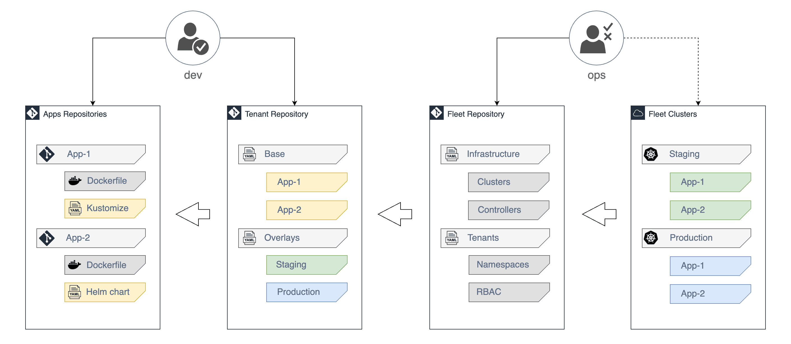

# flux2-multi-tenancy

[](https://github.com/fluxcd/flux2-multi-tenancy/actions)
[](https://github.com/fluxcd/flux2-multi-tenancy/actions)
[](https://github.com/fluxcd/flux2-multi-tenancy/blob/main/LICENSE)

This repository serves as a starting point for managing multi-tenant clusters with Git and Flux v2.



## Roles

**Platform Admin**

- Has cluster admin access to the fleet of clusters
- Has maintainer access to the fleet Git repository
- Manages cluster wide resources (CRDs, controllers, cluster roles, etc)
- Onboards the tenant’s main `GitRepository` and `Kustomization` 
- Manages tenants by assigning namespaces, service accounts and role binding to the tenant's apps

**Tenant** 

- Has admin access to the namespaces assigned to them by the platform admin
- Has maintainer access to the tenant Git repository and apps repositories 
- Manages app deployments with `GitRepositories` and `Kustomizations`
- Manages app releases with `HelmRepositories` and `HelmReleases`

## Repository structure

The [platform admin repository](https://github.com/fluxcd/flux2-multi-tenancy/tree/main) contains the following top directories:

- **clusters** dir contains the Flux configuration per cluster
- **infrastructure** dir contains common infra tools such as admission controllers, CRDs and cluster-wide polices
- **tenants** dir contains namespaces, service accounts, role bindings and Flux custom resources for registering tenant repositories

```
├── clusters
│   ├── production
│   └── staging
├── infrastructure
│   ├── kyverno
│   └── kyverno-policies
└── tenants
    ├── base
    ├── production
    └── staging
```

A [tenant repository](https://github.com/fluxcd/flux2-multi-tenancy/tree/dev-team) contains the following top directories:

- **base** dir contains `HelmRepository` and `HelmRelease` manifests
- **staging** dir contains `HelmRelease` Kustomize patches for deploying pre-releases on the staging cluster
- **production** dir contains `HelmRelease` Kustomize patches for deploying stable releases on the production cluster

```
├── base
│   ├── kustomization.yaml
│   ├── podinfo-release.yaml
│   └── podinfo-repository.yaml
├── production
│   ├── kustomization.yaml
│   └── podinfo-values.yaml
└── staging
    ├── kustomization.yaml
    └── podinfo-values.yaml
```

## Bootstrap the staging cluster

Install the Flux CLI and fork this repository on your personal GitHub account
and export your GitHub username and repo name:

```sh
export GITHUB_USER=<your-username>
export GITHUB_REPO=<repository-name>
```

Verify that your staging cluster satisfies the prerequisites with:

```sh
flux check --pre
```

Set the `--context` argument to the kubectl context to your staging cluster and bootstrap Flux:

```sh
flux bootstrap github \
    --context=your-staging-context \
    --owner=${GITHUB_USER} \
    --repository=${GITHUB_REPO} \
    --branch=main \
    --personal \
    --path=clusters/staging
```

At this point flux cli will ask you for your `GITHUB_TOKEN` (a.k.a [Personal Access Token]).

> **NOTE:** The `GITHUB_TOKEN` is used exclusively by the flux CLI during the bootstrapping process,
> and does not leave your machine. The credential is used for
> configuring the GitHub repository and registering the deploy key.

The bootstrap command commits the manifests for the Flux components in `clusters/staging/flux-system` dir
and creates a deploy key with read-only access on GitHub, so it can pull changes inside the cluster.

Wait for the staging cluster reconciliation to finish:

```console
$ flux get kustomizations --watch
NAME            	READY  	MESSAGE                                                        	
flux-system     	True   	Applied revision: main/616001c38e7bc81b00ef2c65ac8cfd58140155b8	
kyverno         	Unknown	Reconciliation in progress
kyverno-policies	False  	Dependency 'flux-system/kyverno' is not ready
tenants         	False  	Dependency 'flux-system/kyverno-policies' is not ready
```

Verify that the tenant Git repository has been cloned:

```console
$ flux -n apps get sources git
NAME    	READY	MESSAGE 
dev-team	True 	Fetched revision: dev-team/ca8ec25405cc03f2f374d2f35f9299d84ced01e4
```

Verify that the tenant Helm repository index has been downloaded:

```console
$ flux -n apps get sources helm
NAME   	READY	MESSAGE
podinfo	True 	Fetched revision: 2022-05-23T10:09:58.648748663Z
```

Wait for the demo app to be installed:

```console
$ watch flux -n apps get helmreleases
NAME   	READY	MESSAGE                         	REVISION	SUSPENDED 
podinfo	True 	Release reconciliation succeeded	5.0.3   	False 
```

To expand on this example, check the [enforce tenant isolation](#enforce-tenant-isolation) for security related considerations. 

[Personal Access Token]: https://docs.github.com/en/authentication/keeping-your-account-and-data-secure/creating-a-personal-access-token

### Onboard new tenants

The Flux CLI offers commands to generate the Kubernetes manifests needed to define tenants.

Assuming a platform admin wants to create a tenant named `dev-team` with access to the `apps` namespace.

Create the tenant base directory:

```sh
mkdir -p ./tenants/base/dev-team
```

Generate the namespace, service account and role binding for the dev-team:

```sh
flux create tenant dev-team --with-namespace=apps \
    --export > ./tenants/base/dev-team/rbac.yaml
```

Create the sync manifests for the tenant Git repository:

```sh
flux create source git dev-team \
    --namespace=apps \
    --url=https://github.com/<org>/<dev-team> \
    --branch=main \
    --export > ./tenants/base/dev-team/sync.yaml

flux create kustomization dev-team \
    --namespace=apps \
    --service-account=dev-team \
    --source=GitRepository/dev-team \
    --path="./" \
    --export >> ./tenants/base/dev-team/sync.yaml
```

Create the base `kustomization.yaml` file:

```sh
cd ./tenants/base/dev-team/ && kustomize create --autodetect --namespace apps 
```

Create the staging overlay and set the path to the staging dir inside the tenant repository:

```sh
cat << EOF | tee ./tenants/staging/dev-team-patch.yaml
apiVersion: kustomize.toolkit.fluxcd.io/v1
kind: Kustomization
metadata:
  name: dev-team
  namespace: apps
spec:
  path: ./staging
EOF

cat << EOF | tee ./tenants/staging/kustomization.yaml
apiVersion: kustomize.config.k8s.io/v1beta1
kind: Kustomization
namespace: apps
resources:
  - ../base/dev-team
patches:
  - path: dev-team-patch.yaml
EOF
```

With the above configuration, the Flux instance running on the staging cluster will clone the
dev-team's repository, and it will reconcile the `./staging` directory from the tenant's repo
using the `dev-team` service account. Since that service account is restricted to the `apps` namespace,
the dev-team repository must contain Kubernetes objects scoped to the `apps` namespace only.

#### Tenant onboarding via Kyverno

Alternatively to the `flux create tenant` approach, Kyverno's [resource generation] feature can
be leveraged to the same effect.

[resource generation]: https://kyverno.io/docs/writing-policies/generate/

## Enforce tenant isolation

To enforce tenant isolation, cluster admins must configure Flux to reconcile 
the `Kustomization` and `HelmRelease` kinds by impersonating a service account
from the namespace where these objects are created. 

Flux has built-in [multi-tenancy lockdown] features which enables tenant isolation 
at Control Plane level without the need of external admission controllers (e.g. Kyverno). The
recommended patch:

- Enforce controllers to block cross namespace references.
  Meaning that a tenant can’t use another tenant’s sources or subscribe to their events.
- Deny accesses to Kustomize remote bases, thus ensuring all resources refer to local files. 
  Meaning that only approved Flux Sources can affect the cluster-state.
- Sets a default service account via `--default-service-account` to `kustomize-controller` and `helm-controller`.
  Meaning that, if a tenant does not specify a service account in a Flux `Kustomization` or 
  `HelmRelease`, it would automatically default to said account. 

> **NOTE:** It is recommended that the default service account has no privileges.
> And each named service account used observes the least privilege model.

This repository applies this patch automatically via
[kustomization.yaml](clusters/production/flux-system/kustomization.yaml) in both clusters.

```yaml
apiVersion: kustomize.config.k8s.io/v1beta1
kind: Kustomization
resources:
  - gotk-components.yaml
  - gotk-sync.yaml
patches:
  - patch: |
      - op: add
        path: /spec/template/spec/containers/0/args/-
        value: --no-cross-namespace-refs=true
    target:
      kind: Deployment
      name: "(kustomize-controller|helm-controller|notification-controller|image-reflector-controller|image-automation-controller)"
  - patch: |
      - op: add
        path: /spec/template/spec/containers/0/args/-
        value: --no-remote-bases=true
    target:
      kind: Deployment
      name: "kustomize-controller"
  - patch: |
      - op: add
        path: /spec/template/spec/containers/0/args/-
        value: --default-service-account=default
    target:
      kind: Deployment
      name: "(kustomize-controller|helm-controller)"
  - patch: |
      - op: add
        path: /spec/serviceAccountName
        value: kustomize-controller
    target:
      kind: Kustomization
      name: "flux-system"
```

### Side Effects

When Flux is bootstrapped with the patch both `kustomize-controller` and `helm-controller` will impersonate the `default`
service account in the tenant namespace when applying changes to the cluster. The `default` service account 
exist in all namespaces and should always be kept without any privileges.

To enable a tenant to operate, a service account must be created with the required permissions and its name set 
to the `spec.serviceAccountName` of all `Kustomization` and `HelmRelease` resources the tenant has.

### Tenancy policies

Depending on the aimed security posture, the Platform Admin may impose additional policies to enforce specific 
behaviours. Below are a few consideration points, some of which are already implemented in this repository.

#### Image provenance

Assuring the provenance of container images across a cluster can be achieved on several ways.

The [verify-flux-images policy](infrastructure/kyverno-policies/verify-flux-images.yaml)
ensures that all Flux images used are the ones built and signed by the Flux team:

```yaml
apiVersion: kyverno.io/v1
kind: ClusterPolicy
metadata:
  name: verify-flux-images
spec:
  validationFailureAction: enforce
  background: false
  webhookTimeoutSeconds: 30
  failurePolicy: Fail
  rules:
    - name: verify-cosign-signature
      match:
        resources:
          kinds:
            - Pod
      verifyImages:
        - imageReferences:
            - "ghcr.io/fluxcd/source-controller:*"
            - "ghcr.io/fluxcd/kustomize-controller:*"
            - "ghcr.io/fluxcd/helm-controller:*"
            - "ghcr.io/fluxcd/notification-controller:*"
          attestors:
            - entries:
                - keyless:
                    subject: "https://github.com/fluxcd/*"
                    issuer: "https://token.actions.githubusercontent.com"
                    rekor:
                      url: https://rekor.sigstore.dev
```

Other policies to explore:
- Restrict what repositories can be accessed in each cluster. Some deployments may need this to be environment-specific.
- Align image policies with pods that require `securityContext` that are highly privileged.

#### Flux Sources

Flux uses sources to define the origin of flux manifests. Some deployments may require that 
all of them come from a specific GitHub Organisation, as the
[verify-git-repositories policy](infrastructure/kyverno-policies/verify-git-repositories.yaml) shows:

```yaml
apiVersion: kyverno.io/v1
kind: ClusterPolicy
metadata:
  name: verify-git-repositories
spec:
  validationFailureAction: audit # Change to 'enforce' once the specific org url is set.
  rules:
    - name: github-repositories-only
      exclude:
        resources:
          namespaces:
            - flux-system
      match:
        resources:
          kinds:
            - GitRepository
      validate:
        message: ".spec.url must be from a repository within the organisation X"
        anyPattern:
        - spec:
            url: "https://github.com/fluxcd/?*" # repositories in fluxcd via https
        - spec:
            url: "ssh://git@github.com:fluxcd/?*" # repositories in fluxcd via ssh
```

Other policies to explore:
- Expand the policies to `HelmRepository` and `Bucket`.
- For `HelmRepository` and `GitRepository` consider which protocols should be allowed.
- For `Bucket`, consider restrictions on providers and regions.

#### Make serviceAccountName mandatory

The lockdown patch sets a default service account that is applied to any `Kustomization` and `HelmRelease` 
instances that have no `spec.ServiceAccountName` set.

If the recommended best practices above are followed, such instances won't be able to apply changes to
a cluster as the default service account has no permissions to do so. 

An additional extra could be taken to make the `spec.ServiceAccountName` field  mandatory via a validation 
webhook, for example [Kyverno](https://github.com/kyverno/kyverno) or
[OPA Gatekeeper](https://github.com/open-policy-agent/gatekeeper).
Resulting on `Kustomization` and `HelmRelease` instances not being admitted when `spec.ServiceAccountName` is not set.

#### Reconciliation hierarchy

On cluster bootstrap, you need to configure Flux to deploy the validation webhook and its policies before 
reconciling the tenants repositories.

Inside the `clusters` dir we define in which order the infrastructure items,
and the tenant workloads are going to be reconciled on the staging and production clusters:

```
./clusters/
├── production
│   ├── infrastructure.yaml
│   └── tenants.yaml
└── staging
    ├── infrastructure.yaml
    └── tenants.yaml
```

First we setup the reconciliation of custom resource definitions and their controllers. For this 
example we'll use [Kyverno](https://github.com/kyverno/kyverno):

```yaml
apiVersion: kustomize.toolkit.fluxcd.io/v1
kind: Kustomization
metadata:
  name: kyverno
  namespace: flux-system
spec:
  interval: 10m
  sourceRef:
    kind: GitRepository
    name: flux-system
  path: ./infrastructure/kyverno
  prune: true
  wait: true
  timeout: 5m
```

Then we setup [cluster policies](./infrastructure/kyverno-policies/verify-git-repositories.yaml) 
(Kyverno custom resources) to enforce a specific GitHub Organisation:

```yaml
apiVersion: kustomize.toolkit.fluxcd.io/v1
kind: Kustomization
metadata:
  name: kyverno-policies
  namespace: flux-system
spec:
  dependsOn:
    - name: kyverno
  interval: 5m
  sourceRef:
    kind: GitRepository
    name: flux-system
  path: ./infrastructure/kyverno-policies
  prune: true
```

With `dependsOn` we tell Flux to install Kyverno before deploying the cluster policies.

And finally we setup the reconciliation for the tenants workloads with:

```yaml
apiVersion: kustomize.toolkit.fluxcd.io/v1
kind: Kustomization
metadata:
  name: tenants
  namespace: flux-system
spec:
  dependsOn:
    - name: kyverno-policies
  interval: 5m
  sourceRef:
    kind: GitRepository
    name: flux-system
  path: ./tenants/staging
  prune: true
```

With the above configuration, we ensure that the Kyverno validation webhook will reject `GitRepository`
that don't originate from a specific GitHub Organisation, in our case `fluxcd`.

## Onboard tenants with private repositories

You can configure Flux to connect to a tenant repository
using SSH or token-based authentication. The tenant credentials will be stored 
in the platform admin repository as a Kubernetes secret. 

### Encrypt Kubernetes secrets in Git

In order to store credentials safely in a Git repository, you can use Mozilla's
SOPS CLI to encrypt Kubernetes secrets with OpenPGP, Age or KMS.

Install [gnupg](https://www.gnupg.org/) and [sops](https://github.com/mozilla/sops):

```sh
brew install gnupg sops
```

Generate a GPG key for Flux without specifying a passphrase and retrieve the GPG key ID:

```console
$ gpg --full-generate-key
Email address: fluxcdbot@users.noreply.github.com

$ gpg --list-secret-keys fluxcdbot@users.noreply.github.com
sec   rsa3072 2020-09-06 [SC]
      1F3D1CED2F865F5E59CA564553241F147E7C5FA4
```

Create a Kubernetes secret in the `flux-system` namespace with the GPG private key:

```sh
gpg --export-secret-keys \
--armor 1F3D1CED2F865F5E59CA564553241F147E7C5FA4 |
kubectl create secret generic sops-gpg \
--namespace=flux-system \
--from-file=sops.asc=/dev/stdin
```

You should store the GPG private key in a safe place for disaster recovery,
in case you need to rebuild the cluster from scratch.
The GPG public key can be shared with the platform team, so anyone with 
write access to the platform repository can encrypt secrets.

### Git over SSH

Generate a Kubernetes secret with the SSH and known host keys:

```sh
flux -n apps create secret git dev-team-auth \
    --url=ssh://git@github.com/<org>/<dev-team> \
    --export > ./tenants/base/dev-team/auth.yaml
```

Print the SSH public key and add it as a read-only deploy key to the dev-team repository:

```sh
yq eval '.stringData."identity.pub"' ./tenants/base/dev-team/auth.yaml
```

### Git over HTTP/S

Generate a Kubernetes secret with basic auth credentials:

```sh
flux -n apps create secret git dev-team-auth \
    --url=https://github.com/<org>/<dev-team> \
    --username=$GITHUB_USERNAME \
    --password=$GITHUB_TOKEN \
    --export > ./tenants/base/dev-team/auth.yaml
```

The GitHub token must have read-only access to the dev-team repository.

### Configure Git authentication

Encrypt the `dev-team-auth` secret's data field with sops:

```sh
sops --encrypt \
    --pgp=1F3D1CED2F865F5E59CA564553241F147E7C5FA4 \
    --encrypted-regex '^(data|stringData)$' \
    --in-place ./tenants/base/dev-team/auth.yaml
```

Create the sync manifests for the tenant Git repository referencing the `git-auth` secret:

```sh
flux create source git dev-team \
    --namespace=apps \
    --url=https://github.com/<org>/<dev-team> \
    --branch=main \
    --secret-ref=dev-team-auth \
    --export > ./tenants/base/dev-team/sync.yaml

flux create kustomization dev-team \
    --namespace=apps \
    --service-account=dev-team \
    --source=GitRepository/dev-team \
    --path="./" \
    --export >> ./tenants/base/dev-team/sync.yaml
```

Create the base kustomization.yaml file:

```sh
cd ./tenants/base/dev-team/ && kustomize create --autodetect
```

Configure Flux to decrypt secrets using the `sops-gpg` key:

```yaml
flux create kustomization tenants \
  --depends-on=kyverno-policies \
  --source=flux-system \
  --path="./tenants/staging" \
  --prune=true \
  --interval=5m \
  --validation=client \
  --decryption-provider=sops \
  --decryption-secret=sops-gpg \
  --export > ./clusters/staging/tenants.yaml
```

With the above configuration, the Flux instance running on the staging cluster will:

* create the tenant namespace, service account and role binding
* decrypt the tenant Git credentials using the GPG private key
* create the tenant Git credentials Kubernetes secret in the tenant namespace
* clone the tenant repository using the supplied credentials
* apply the `./staging` directory from the tenant's repo using the tenant's service account

## Testing

Any change to the Kubernetes manifests or to the repository structure should be validated in CI before
a pull request is merged into the main branch and synced on the cluster.

This repository contains the following GitHub CI workflows:

* the [test](./.github/workflows/test.yaml) workflow validates the Kubernetes manifests
  and Kustomize overlays with [kubeconform](https://github.com/yannh/kubeconform)
* the [e2e](./.github/workflows/e2e.yaml) workflow starts a Kubernetes cluster in CI
  and tests the staging setup by running Flux in Kubernetes Kind


[multi-tenancy lockdown]: https://fluxcd.io/flux/installation/configuration/multitenancy/
