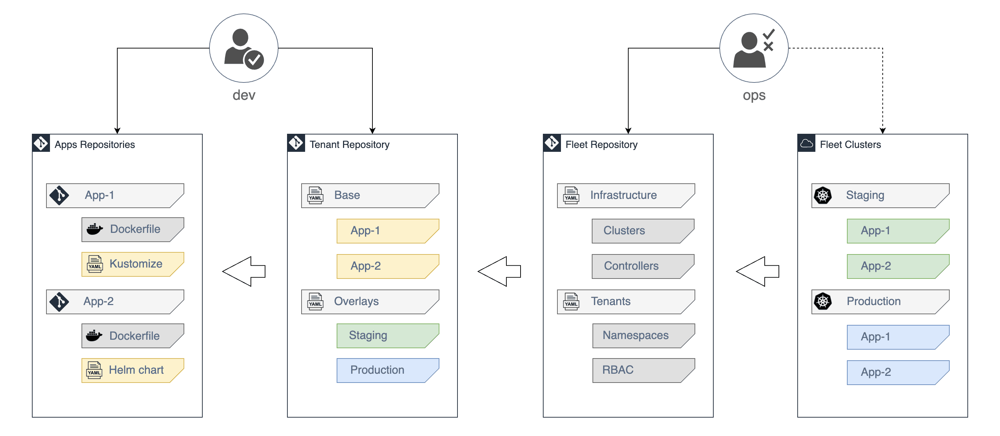

# flux2-multi-tenancy

[](https://github.com/fluxcd/flux2-multi-tenancy/actions)
[](https://github.com/fluxcd/flux2-multi-tenancy/actions)
[](https://github.com/fluxcd/flux2-multi-tenancy/blob/main/LICENSE)

This repository serves as a starting point for managing multi-tenant clusters with Git and Flux v2.



## Flux multi-tenancy features

Flux has built-in support for multi-tenancy on shared clusters by leveraging Kubernetes
namespaces and RBAC to isolate tenants and their workloads.

A single Flux instance can manage multiple tenants by reconciling Kubernetes manifests
from different Git repositories and applying them with the permissions of a service account
assigned to each tenant.

The trust boundary of a tenant is the Kubernetes namespace assigned to it by the platform admin.
Sharing namespaces between tenants is not supported, as it would break the isolation guarantees of Flux.

When the multi-tenancy lockdown is enabled, Flux will:

- Deny cross-namespace access to custom resources, thus ensuring that a tenant
  can’t use another tenant’s sources or subscribe to their events.
- Deny accesses to Kustomize remote bases, thus ensuring all resources refer to local files.
  Meaning that only approved Flux Sources can affect the cluster-state.
- Impersonates tenant service accounts instead of using the controller's service account to reconcile.
  Meaning that, if a tenant does not specify a service account in a Flux `Kustomization` or
  `HelmRelease`, it would automatically default to the `flux` account in the tenant's namespace.

## Flux user roles

**Platform Admin**

- Has cluster admin access to the fleet of clusters
- Has maintainer access to the fleet Git repository
- Manages cluster wide resources (CRDs, controllers, cluster roles, etc) and policies to enforce tenant restrictions
- Manages tenants by assigning namespaces, service accounts and RBAC for the tenant's app delivery
- Onboards the tenant’s main repository using Flux `GitRepository` and `Kustomization` custom resources

**Tenant** 

- Has no direct access to the Kubernetes API, all changes must be made via Git
- Has maintainer access to the GitOps repository and apps repositories
- Can deploy apps with Flux `Kustomizations` and `HelmReleases` from approved sources ( `GitRepository`, `OCIRepository` and `HelmRepository`)
- Can automate image updates with Flux `ImagePolicy` and `ImageUpdateAutomation` from approved sources (`ImageRepository`)
- Can only deploy workloads in the namespaces assigned by the platform admin

## Repository structure

### Fleet repository

The [fleet repository](https://github.com/fluxcd/flux2-multi-tenancy/tree/main) contains the following top directories:

- **clusters** dir contains the Flux configuration per cluster
- **policies** dir contains the cluster-wide admission policies (CEL `ValidatingAdmissionPolicy`)
- **tenants** dir contains namespaces, RBAC and Flux custom resources for registering tenant repositories

```
├── clusters
│   ├── production
│   └── staging
├── policies
│   ├── base
│   ├── production
│   └── staging
└── tenants
    ├── base
    ├── production
    └── staging
```

#### Reconciliation hierarchy

Inside the `clusters` dir we define in which order the policies and the
tenant resources are reconciled on the staging and production clusters:

```
./clusters/
├── production
│   ├── policies.yaml
│   └── tenants.yaml
└── staging
    ├── policies.yaml
    └── tenants.yaml
```

First we set up the reconciliation of the admission policies. These are native
Kubernetes `ValidatingAdmissionPolicy` resources:

```yaml
apiVersion: kustomize.toolkit.fluxcd.io/v1
kind: Kustomization
metadata:
  name: policies
  namespace: flux-system
spec:
  serviceAccountName: kustomize-controller
  sourceRef:
    kind: GitRepository
    name: flux-system
  path: ./policies/staging
  prune: true
  wait: true
  interval: 1h
  timeout: 2m
```

Then we set up the reconciliation for the tenant resources, depending on the policies:

```yaml
apiVersion: kustomize.toolkit.fluxcd.io/v1
kind: Kustomization
metadata:
  name: tenants
  namespace: flux-system
spec:
  serviceAccountName: kustomize-controller
  dependsOn:
    - name: policies
  sourceRef:
    kind: GitRepository
    name: flux-system
  path: ./tenants/staging
  prune: true
  interval: 1h
  timeout: 5m
```

With `dependsOn` we tell Flux to apply the policies before reconciling the tenants.
This ensures that the resources from tenant repositories are subject to the admission policies.

### Tenant repositories

A [tenant repository](https://github.com/fluxcd/flux2-multi-tenancy/tree/dev-team) contains the following top directories:

- **base** dir contains `HelmRelease` manifests and Flux sources for the tenant's application delivery
- **staging** dir contains Kustomize patches for deploying pre-releases on the staging cluster
- **production** dir contains Kustomize patches for deploying stable releases on the production cluster

```
├── base
│   ├── kustomization.yaml
│   ├── podinfo-release.yaml
│   └── podinfo-repository.yaml
├── production
│   ├── kustomization.yaml
│   └── podinfo-values.yaml
└── staging
    ├── kustomization.yaml
    └── podinfo-values.yaml
```

The repository structure mirrors the cluster fleet, with a base directory
for the common configuration and overlays for staging and production environments.

The tenants have full control over their app delivery, adding or modifying Helm releases as needed
within the constraints defined by the platform admins (e.g. allowed namespaces, Helm chart repositories, etc).

## Cluster bootstrap

When bootstrapping a cluster, platform admins must set up the Flux instance with
the multi-tenancy lockdown and configure the reconciliation of the admission policies
before the tenant repositories.

There are two options to bootstrap multi-tenant clusters:

- Use the `flux bootstrap` command with a kustomize patch configured for [multi-tenancy lockdown](https://fluxcd.io/flux/installation/configuration/multitenancy/)
- Use the [Flux Operator](https://fluxoperator.dev/)  with a `FluxInstance` manifest configured with `multitenant: true`

### Flux CLI bootstrap

This repository contains the multi-tenancy kustomize patch for the `flux bootstrap` approach
in the [clusters/staging/flux-system/kustomization.yaml](clusters/staging/flux-system/kustomization.yaml)
and [clusters/production/flux-system/kustomization.yaml](clusters/production/flux-system/kustomization.yaml) files.

Example of bootstrapping the staging cluster with the Flux CLI:

```sh
flux bootstrap github \
  --owner=<org> \
  --repository=<repository> \
  --branch=main \
  --path=clusters/staging
```

The Flux CLI supports SSH and token-based authentication for bootstrapping with private repositories.
For more details, see the CLI [bootstrap documentation](https://fluxcd.io/flux/installation/bootstrap/).

### Flux Operator bootstrap

First we install the operator with multi-tenancy enabled:

```sh
helm install flux-operator oci://ghcr.io/controlplaneio-fluxcd/charts/flux-operator \
  --namespace flux-system \
  --create-namespace \
  --set multitenancy.enabled=true
```

To bootstrap Flux, we create a [FluxInstance](https://fluxoperator.dev/docs/crd/fluxinstance/) with multi-tenancy enabled,
and we also specify the default tenant service account:

```yaml
apiVersion: fluxcd.controlplane.io/v1
kind: FluxInstance
metadata:
  name: flux
  namespace: flux-system
spec:
  distribution:
    version: "2.x"
    registry: "ghcr.io/fluxcd"
  cluster:
    type: kubernetes
    size: medium
    multitenant: true
    tenantDefaultServiceAccount: flux
    networkPolicy: true
    domain: "cluster.local"
  sync:
    kind: GitRepository
    url: "https://github.com/my-org/my-fleet.git"
    ref: "refs/heads/main"
    path: "clusters/my-cluster"
```

For more details on how to configure the Git authentication including GitHub App support,
see the [cluster sync documentation](https://fluxoperator.dev/docs/instance/sync/).

### Admission policies

While Flux isolates tenants to their assigned namespaces, it does not restrict the origin
of the resources that tenants can deploy. Tenants can reference any Git repository,
container registry or Helm chart repository to deploy their workloads,
which may not be desirable.

Platform admins can define admission policies to harden the delivery pipeline
and enforce an allowlist of approved sources for tenants to deploy their workloads.

#### Flux sources restriction

A common policy is to restrict the origin of Flux sources to prevent tenants
from deploying workloads from repositories outside the organization’s control.

```yaml
apiVersion: admissionregistration.k8s.io/v1
kind: ValidatingAdmissionPolicy
metadata:
  name: flux-tenant-sources
spec:
  failurePolicy: Fail
  paramKind:
    apiVersion: v1
    kind: ConfigMap
  matchConstraints:
    resourceRules:
      - apiGroups:   ["source.toolkit.fluxcd.io"]
        apiVersions: ["v1"]
        operations:  ["CREATE", "UPDATE"]
        resources:
          - gitrepositories
          - ocirepositories
          - helmrepositories
      - apiGroups:   ["image.toolkit.fluxcd.io"]
        apiVersions: ["*"]
        operations:  ["CREATE", "UPDATE"]
        resources:
          - imagerepositories
  variables:
    - name: prefixes
      expression: "params.data['allowedPrefixes'].split('\\n').filter(p, p != '')"
    - name: url
      expression: "has(object.spec.url) ? object.spec.url : 'oci://' + object.spec.image"
  validations:
    - expression: "variables.prefixes.exists(p, variables.url.startsWith(p))"
      messageExpression: "'spec.url \"' + variables.url + '\" is not allowed. Permitted prefixes: ' + variables.prefixes.join(', ')"
      reason: Forbidden
```

The above policy prevents tenants from creating Flux sources that don't match the allowed URL prefixes,
thus ensuring that tenants can only use approved sources to deploy their workloads. The same allowlist
is applied to `ImageRepository` resources, treating `spec.image` as an `oci://` URL so the image registry
prefixes are reused for image scanning.

The platform admins can maintain the list of allowed URL prefixes in a ConfigMap that
can be updated without the need to change the admission policy:

```yaml
apiVersion: v1
kind: ConfigMap
metadata:
  name: flux-tenant-sources-allowlist
  namespace: flux-system
data:
  allowedPrefixes: |
    https://github.com/my-org/
    oci://ghcr.io/my-org/
```

Note that we also deny the usage of Flux Bucket sources with the
[`flux-tenant-buckets`](policies/base/buckets.yaml) policy.

On the production cluster, all Flux image automation resources (`ImageRepository`, `ImagePolicy`
and `ImageUpdateAutomation`) are rejected outright by the
[`flux-tenant-image-automation`](policies/production/image-automation.yaml) policy.
Image automation remains permitted on staging
where the sources allowlist constrains which registries can be scanned.

#### Flux service account restriction

The `flux` service account has broad permissions to manage resources inside
a tenant namespace and should not be used by tenant workloads.

To enforce this we reject any pod that runs with the `flux` service account
in tenant namespaces with the following admission policy:

```yaml
apiVersion: admissionregistration.k8s.io/v1
kind: ValidatingAdmissionPolicy
metadata:
  name: flux-tenant-pods
spec:
  failurePolicy: Fail
  matchConstraints:
    resourceRules:
      - apiGroups:   [""]
        apiVersions: ["v1"]
        operations:  ["CREATE", "UPDATE"]
        resources:   ["pods"]
  validations:
    - expression: "object.spec.serviceAccountName != 'flux'"
      message: "pods in tenant namespaces cannot run under the 'flux' ServiceAccount"
      reason: Forbidden
```

Note that we also deny tenants from targeting remote clusters via
`spec.kubeconfig` in Flux Kustomizations and HelmReleases with the
[`flux-tenant-kubeconfig`](policies/base/kubeconfig.yaml) policy.

## Onboard tenants with private repositories

You can configure Flux to connect to a tenant repository
using SSH, PAT ot GitHub App authentication. The tenant credentials will be stored 
in the platform admin repository as a Kubernetes secret. 

### Encrypt Kubernetes secrets in Git

In order to store credentials safely in a Git repository, you can use the
SOPS CLI to encrypt Kubernetes secrets with Age or KMS.

Install [age](https://github.com/filosottile/age) and [sops](https://github.com/getsops/sops):

```sh
brew install age sops
```

Generate an Age key pair using the `age-keygen` command:

```console
$ age-keygen -o sops.agekey
Public key: age1helqcqsh9464r8chnwc2fzj8uv7vr5ntnsft0tn45v2xtz0hpfwq98cmsg
```

Create a Kubernetes secret in the `flux-system` namespace with the Age private key:

```sh
kubectl create secret generic sops-age \
--namespace=flux-system \
--from-file=sops.agekey
```

You should store the Age private key in a safe place for disaster recovery,
in case you need to rebuild the cluster from scratch.
The Age public key can be shared with the platform team, so anyone with 
write access to the platform repository can encrypt secrets.

### Git over SSH

Generate a Kubernetes secret with the SSH and known host keys:

```sh
flux -n apps create secret git dev-team-auth \
    --url=ssh://git@github.com/<org>/<dev-team> \
    --export > ./tenants/base/dev-team/auth.yaml
```

Print the SSH public key and add it as a read-only deploy key to the dev-team repository:

```sh
yq eval '.stringData."identity.pub"' ./tenants/base/dev-team/auth.yaml
```

### Git over HTTP/S

Generate a Kubernetes secret with basic auth credentials:

```sh
flux -n apps create secret git dev-team-auth \
    --url=https://github.com/<org>/<dev-team> \
    --username=$GITHUB_USERNAME \
    --password=$GITHUB_TOKEN \
    --export > ./tenants/base/dev-team/auth.yaml
```

The GitHub token must have read-only access to the dev-team repository.

### Configure Git authentication

Encrypt the `dev-team-auth` secret's data field with sops:

```sh
sops --encrypt \
    --age=age1helqcqsh9464r8chnwc2fzj8uv7vr5ntnsft0tn45v2xtz0hpfwq98cmsg \
    --encrypted-regex '^(data|stringData)$' \
    --in-place ./tenants/base/dev-team/auth.yaml
```

Create the sync manifests for the tenant Git repository referencing the `git-auth` secret:

```sh
flux create source git dev-team \
    --namespace=apps \
    --url=https://github.com/<org>/<dev-team> \
    --branch=main \
    --secret-ref=dev-team-auth \
    --export > ./tenants/base/dev-team/sync.yaml

flux create kustomization dev-team \
    --namespace=apps \
    --service-account=flux \
    --source=GitRepository/dev-team \
    --path="./" \
    --export >> ./tenants/base/dev-team/sync.yaml
```

Create the base kustomization.yaml file:

```sh
cd ./tenants/base/dev-team/ && kustomize create --autodetect
```

Configure Flux to decrypt secrets using the `sops-age` key:

```yaml
flux create kustomization tenants \
  --depends-on=policies \
  --source=flux-system \
  --path="./tenants/staging" \
  --prune=true \
  --interval=5m \
  --decryption-provider=sops \
  --decryption-secret=sops-age \
  --export > ./clusters/staging/tenants.yaml
```

With the above configuration, the Flux instance running on the staging cluster will:

* create the tenant namespace, service account and role binding
* decrypt the tenant Git credentials using the Age private key
* create the tenant Git credentials Kubernetes secret in the tenant namespace
* clone the tenant repository using the supplied credentials
* apply the `./staging` directory from the tenant's repo using the tenant's service account

#### Tenant onboarding via Flux Operator

Alternatively to the `flux create tenant` approach, the platform admins can onboard tenants
using the Flux Operator [ResourceSet](https://fluxoperator.dev/docs/crd/resourceset/) API.

For an example of how to create tenants using OCI Artifacts as the desired state storage,
see the [d2-fleet](https://github.com/controlplaneio-fluxcd/d2-fleet) repository.

## Testing

Any change to the Kubernetes manifests or to the repository structure should be validated in CI before
a pull request is merged into the main branch and synced on the cluster.

This repository contains the following GitHub CI workflows:

* the [test](./.github/workflows/test.yaml) workflow validates the Kubernetes manifests
  and Kustomize overlays with [flux-schema](https://github.com/fluxcd/flux-schema)
* the [e2e](./.github/workflows/e2e.yaml) workflow starts a Kubernetes cluster in CI
  and tests the staging setup by running Flux in Kubernetes Kind
